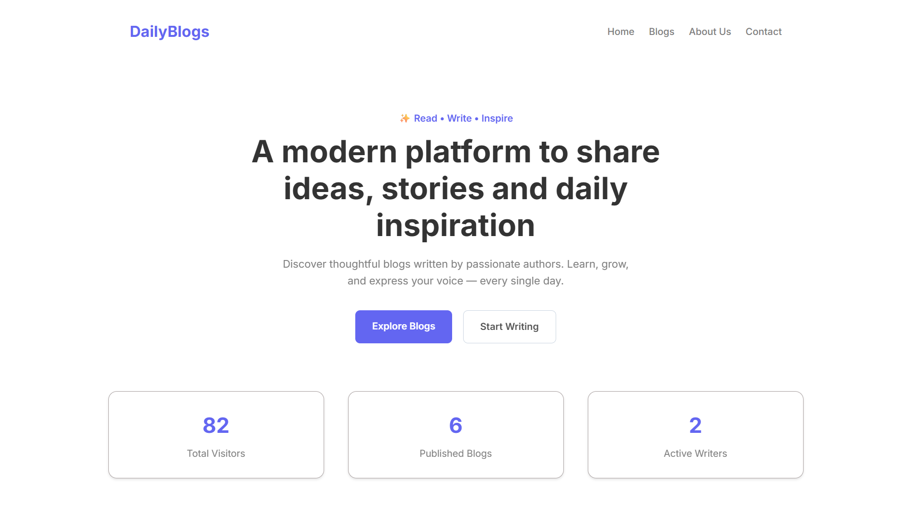
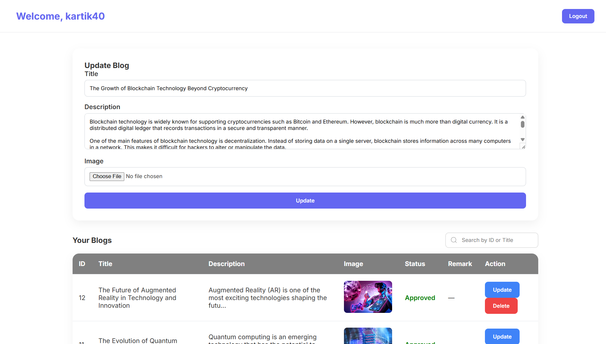
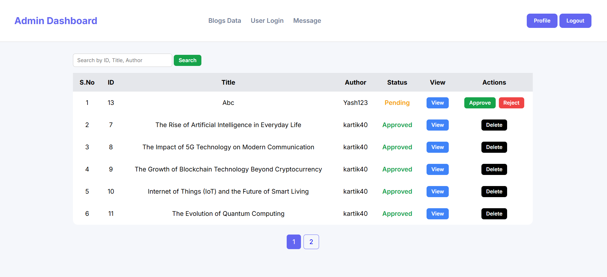
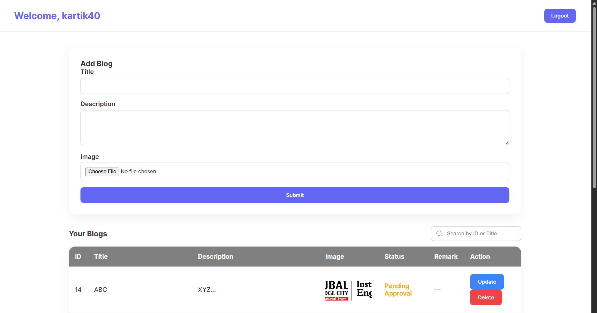
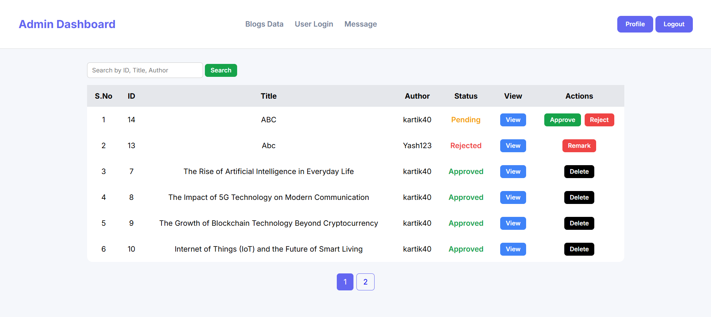
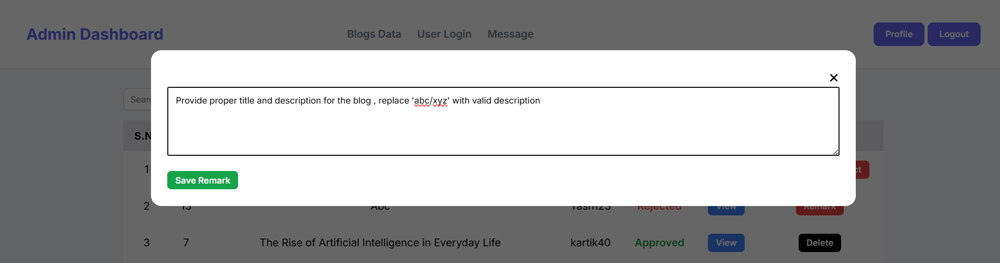
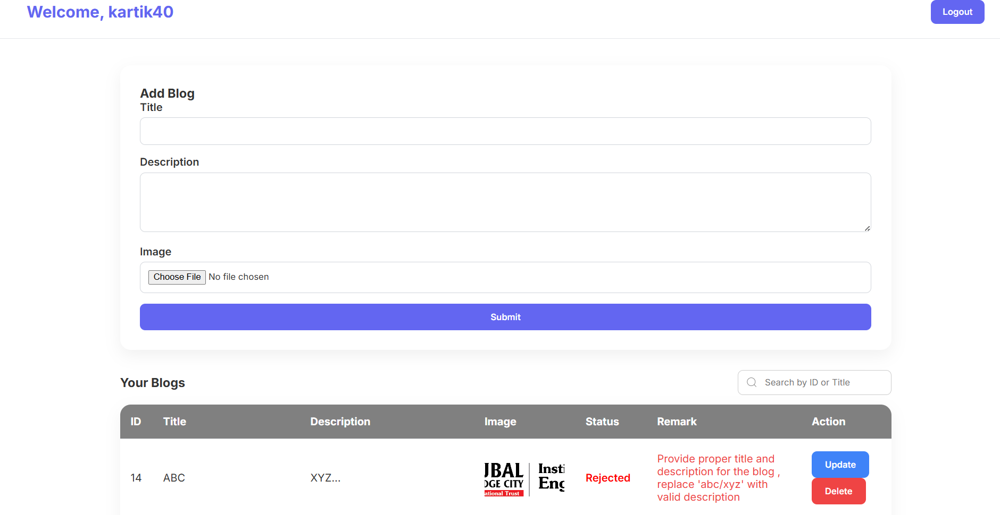

# DailyBlog – Full Stack Blogging Platform

## Overview

**DailyBlog** is a full-stack web application designed to provide a complete blogging platform for content creation, publication, and administration. The system enables registered users to create and submit blog posts while providing administrators with a dedicated dashboard to review, approve, reject, and manage submitted content.

The application follows a traditional client-server architecture, utilizing **PHP** for server-side processing, **MySQL** for database management, and **HTML5, CSS3, JavaScript, Bootstrap, and AJAX** for the frontend. The project demonstrates CRUD operations, session-based authentication, role-based authorization, asynchronous validation, and dynamic database-driven content rendering.

---

# Key Features

## User Module

* User registration and secure login
* Session-based authentication
* Create and publish blog posts
* View approved blog articles
* Search blogs by title and author
* Pagination for efficient data browsing
* Responsive user dashboard

---

## Blog Management

* Dynamic blog rendering from MySQL database
* Detailed blog view using modal dialogs
* AJAX-powered search functionality
* Blog filtering based on approval status
* Pagination for optimized performance

---

## Administrator Module

* Dedicated administrator authentication
* Dashboard for centralized blog management
* Approve blog submissions
* Reject blogs with remarks
* Delete blog posts
* Search and pagination support
* Dynamic status management

---

# Technology Stack

## Frontend

* HTML5
* CSS3
* JavaScript
* Bootstrap 5
* AJAX

## Backend

* PHP

## Database

* MySQL

## Development Tools

* Visual Studio Code
* XAMPP
* phpMyAdmin

---

# System Architecture

```
Client (Browser)
        │
        ▼
HTML • CSS • JavaScript • Bootstrap
        │
        ▼
          PHP
        │
        ▼
      MySQL Database
```

---

# Core Functionalities

### Authentication

* User Registration
* User Login
* Administrator Login
* Session Management
* Logout

### Blog Operations

* Create Blog
* Publish Blog
* Read Blogs
* Search Blogs
* Pagination

### Administration

* Review Blog Requests
* Approve Blog
* Reject Blog
* Add Rejection Remarks
* Delete Blog
* Manage Blog Status

---

# Database Operations

The application performs the following SQL operations:

| Operation | Description                              |
| --------- | ---------------------------------------- |
| INSERT    | Store user accounts and blog posts       |
| SELECT    | Retrieve blogs and user information      |
| UPDATE    | Update blog status and rejection remarks |
| DELETE    | Remove blog records                      |

---

# Security Features

* Password hashing
* Session-based authentication
* Role-based access control
* AJAX validation for duplicate username and email
* Server-side input validation
* Client-side form validation

---

# Project Structure

```
DailyBlog/
│
├── css/
│   ├── admin.css
│   ├── blog.css
│   ├── index.css
│   └── user_dashboard.css
│
├── screenshots/
│   ├── index.png
│   ├── blog.png
│   ├── admin_dash.png
│   ├── pending_status.png
│   ├── admin_dashboard_accept_reject_blog.png
│   ├── remark.png
│   ├── Rejected_blog_with_remark.png
│   └── user_dash.png
│
├── .htaccess
├── 403.php
├── 404.php
├── admin.php
├── adminlogin.php
├── blog.php
├── dailyblog.sql
├── index.php
├── loader.php
├── login.php
├── logout.php
├── README.md
├── register.php
├── Rconfig.php
├── user_dashboard.php
└── user_details_form.php
```

---

# Installation

## Prerequisites

* PHP 8.x or above
* MySQL
* XAMPP
* Web Browser

---

## Setup Instructions

### 1. Clone the Repository

```bash
git clone https://github.com/your-username/DailyBlog.git
```

### 2. Move the Project

Copy the project folder into the **htdocs** directory.

```
xampp/
└── htdocs/
    └── DailyBlog/
```

### 3. Start XAMPP

Start the following services:

* Apache
* MySQL

### 4. Import the Database

* Open **phpMyAdmin**
* Create a database
* Import `dailyblog.sql`

### 5. Configure Database

Update database credentials inside:

```
Rconfig.php
```

### 6. Run the Application

```
http://localhost/DailyBlog/
```

---

# Screenshots

## Home Page



---

## Blog Listing


---

## User Dashboard



---

## Admin Dashboard



---

## Pending Blog Status



---

## Blog Approval and Rejection



---

## Rejection Remark



---

## Rejected Blog with Remark



---

# Future Enhancements

* Rich text editor for blog creation
* Image upload optimization
* Blog categories and tags
* User profile management
* Comment system
* Like and bookmark functionality
* Email verification
* Password recovery
* Responsive admin analytics dashboard
* REST API integration

---

# Learning Outcomes

This project demonstrates practical implementation of:

* Full Stack Web Development
* PHP Server-Side Programming
* MySQL Database Design
* CRUD Operations
* Session Management
* Role-Based Authentication
* AJAX Integration
* Responsive Web Design
* Database Normalization
* MVC-Oriented Development Concepts

---

# Author

**Kartik Kale**

Computer Engineering Student

---

# License

This project is developed for educational and learning purposes.
